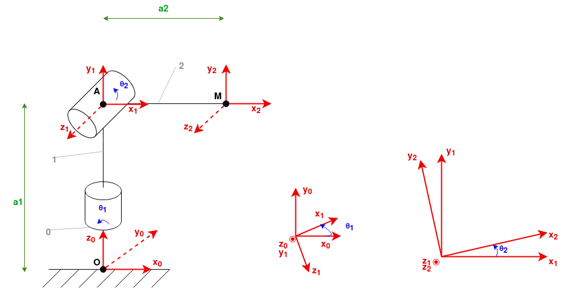

# 2 dof robotic arm

Commençons par monter uniquement deux servomoteurs sur notre bras. 
En respectant les conventions de **Denavit-Hartenberg**, nous pouvons construire le schéma représentatif :

Une fois la position initiale du robot choisie, ici un angle de 90° entre le segment **OA** et **AM**, nous pouvons écrire les matrices de transitions correspondantes :

$$
T01 = 
\left(\begin{array}{cc}
C1 & 0 & S1 & 0\\\\
S1 & 0 & -C1 & 0\\\\
0 & 1 & 0 & a_1\\\\
0 & 0 & 0 & 1
\end{array}\right)
$$

$$
T12 = 
\left(\begin{array}{cc}
C2 & -S2 & 0 & a_2C2\\\\
S2 & C2 & 0 & a_2S2\\\\
0 & 0 & 1 & 0\\\\
0 & 0 & 0 & 1
\end{array}\right)
$$

Une fois les matrices de transitions pour chaque liaisons réalisés, nous pouvons faire leur produit matriciel afin d'obtenir la matrice caractéristique du système étudié. 

$$
T02 = 
\left(\begin{array}{cc}
C1C2 & -C1S2 & S1 & a_2C1C2\\\\
S1C2 & -S1S2 & -C1 & a_2S1C2\\\\
S2 & C2 & 0 & a_1 + a_2S2\\\\
0 & 0 & 0 & 1
\end{array}\right)
$$

Dans ce cas précis, avec uniquement deux liaisons, le système est relativement simple et nous pouvons nous contenter d'utiliser la dernière colonne de la matrice qui représente les équations de la position finale du bras en fonction des angles des moteurs.

$$ 
\begin{cases}
    x_0 = a_2 * cos(θ_1) * cos(θ_2) \\\\
    y_0 = a_2 * sin(θ_1) * cos(θ_2) \\\\
    z_0 = a_1 + a_2 * sin(θ_2)
\end{cases}
$$

L'équation de **z0** nous donne la valeur du **sinus de θ2** :
$$
S2 = (z - a_1) / a_2
$$
En utilisant le fait que **cos2 + sin2 = 1**, on obtient deux valeurs possibles pour le **cosinus de θ2** :
$$
C2 = ±\sqrt{1 - S2²}
$$
Enfin, nous pouvons obtenir la valeur de **θ2** en utilisant la fonction tangente. A noté que dans notre cas, la première solution (signe positif du calcul précédent) nous donne toujours la donnée la plus efficace pour résoudre notre système :
$$
θ_2 = atan2(\cfrac{S2}{C2})
$$

Pour **θ1**, nous pouvons calculer son sinus et son cosinus à partir des équations de Y et X :
$$
\begin{cases}
    S1  = \cfrac{y}{a_2 * cos(θ_2)}\\\\
    C1 = \cfrac{x}{a_2 * cos(θ_2)}
\end{cases}
$$
on obtient ainsi **θ1** de la même manière que **θ2** :
$$
θ_1 = atan2(\cfrac{S1}{C1})
$$
