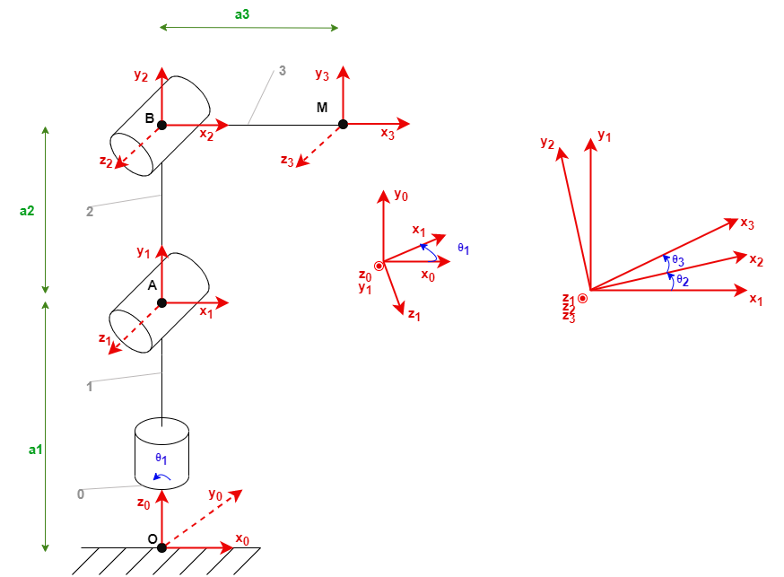

# 3_dof robotic arm

Ajoutons un servo-moteur à notre bras. 
Nous obtenons ainsi un système comprenant 3 degrés de libertés. 

## Schéma cinématique
En respectant les conventions de **Denavit-Hartenberg**, nous pouvons construire le schéma représentatif :


## Matrices de transition
Nous choisissons pour cette étude de changer la position initiale entre le segment **OA** et **AB**, que nous fixons à 180°. Pour la position initiale du 3ème moteur, nous choisissons un angle de 90° entre le segment **AB** et **BM**. Nous pouvons ainsi écrire les matrices de transitions correspondantes :

$$
T01 = 
\left(\begin{array}{cc}
C1 & 0 & S1 & 0\\\\
S1 & 0 & -C1 & 0\\\\
0 & 1 & 0 & a_1\\\\
0 & 0 & 0 & 1
\end{array}\right)
$$

$$
T12 = 
\left(\begin{array}{cc}
C2 & -S2 & 0 & -a_2S2\\\\
S2 & C2 & 0 & a_2C2\\\\
0 & 0 & 1 & 0\\\\
0 & 0 & 0 & 1
\end{array}\right)
$$

$$
T23 = 
\left(\begin{array}{cc}
C3 & -S3 & 0 & a_3C2\\\\
S3 & C3 & 0 & a_3S2\\\\
0 & 0 & 1 & 0\\\\
0 & 0 & 0 & 1
\end{array}\right)
$$

## Matrice caractéristique
La matrice représentative du système est alors plus complexe, et l'on commence à distinguer quelques difficultés à trouver une solution simple au système : 

$$
T03 = 
\left(\begin{array}{cc}
C1(C2C3 - S2S3) & -C1(S2C3 + C2S3) & S1 & C1(-a_2S2 + a_3C23)\\\\
S1(C2C3 - S2S3) & -S1(S2C3 + C2S3) & -C1 & S1(-a_2S2 + a_3C23)\\\\
S2C3 + S3C2 & -S2S3 + C2C3 & 0 & a_1 + a_2C2 + a_3S23\\\\
0 & 0 & 0 & 1
\end{array}\right)
$$

## Cinématique normale
Cependant, en utilisant toujours uniquement les équations sur (X, Y, Z), on obtient un système à 3 équations et 3 inconnues qu'il est possible de résoudre. 

$$ 
\begin{cases}
    x = cos(θ_1)(-a_2 * sin(θ_2) + a_3 * cos(θ_2 + θ_3)) \\\\
    y = sin(θ_1)(-a_2 * sin(θ_2) + a_3 * cos(θ_2 + θ_3))\\\\
    z = a_1 + a_2 * sin(θ_2)
\end{cases}
$$

## Cinématique inverse
### θ<sub>1</sub>
En effet, on constate qu'il est facile d'obtenir **θ<sub>1</sub>**, en utilisant la même méthode que pour le bras 2ddl :
$$
θ_1 = atan2(\cfrac{y}{x})
$$

### θ<sub>3</sub>
Ensuite, **sin(θ<sub>3</sub>)** est obtenu en faisant la somme des trois équations misent au carré, et en utilisant les propriétés du sinus sin(a-b) :
$$
sin(θ_3) = \cfrac{a_1^2 - a_2^2 - a_3^2 + x^2 + y^2 + z^2 - 2 * a_1 * z} {2 * a_2 * a_3}
$$

On récupère ensuite la valeur de **cos(θ<sub>3</sub>)** en utilisant la propriété **cos² + sin² = 1**
$$
C3 = ±\sqrt{1 - S3^2}
$$
On peut noter que l'on aura deux valeurs possibles de **θ<sub>3</sub>**, qui correspondront à deux configurations possibles du bras. 
$$
θ_3 = atan2(\cfrac{S3}{C3})
$$


### θ<sub>2</sub>
Une fois **θ<sub>1</sub>** et **θ<sub>3</sub>** obtenus, il est alors possible, en simplifiant les équations, de retrouver un système à deux équations et 2 inconnues (C2 et S2)
$$
soit :
\begin{cases}
k_1 = a_2 + a_3 * S3\\\\
k_2 = a_3 * C3\\\\
Z = z - a_1\\\\
X = \cfrac{x - y} {C1 - S1}\\\\
\end{cases}
alors :
\begin{cases}
X = k_2 * C2 - k_1 * S2\\\\
Z = k_1 * C2 + k_2 * S2
\end{cases}
$$

Pour simplifier cette partie là, nous avons laissé à Python le soin de résoudre le système pour nous : 
```python
eq1 = sp.Eq(k2 * C2 - k1 * S2, X)
eq2 = sp.Eq(k1 * C2 + k2 * S2, Z)
eq = [eq1, eq2]

sol = sp.solve(eq, C2, S2)
theta_2 = math.atan2(sol[S2], sol[C2])
```
