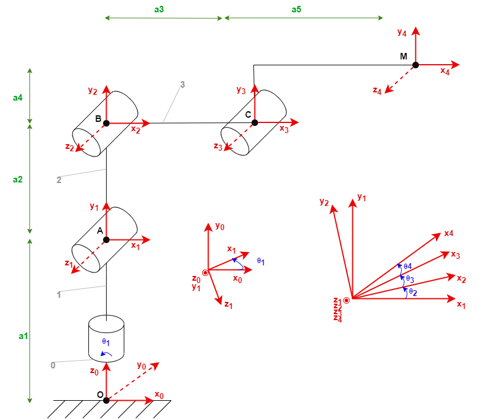

# 4 dof robotic arm

Ajoutons un servo-moteur à notre bras. 
Nous obtenons ainsi un système comprenant 4 degrés de libertés. 

## Schéma cinématique

## Matrices de transition
La position initiale du 4ème moteur est fixée dans le même axe que le moteur précedent.

$$
T01 = 
\left(\begin{array}{cc}
C1 & 0 & S1 & 0\\\\
S1 & 0 & -C1 & 0\\\\
0 & 1 & 0 & a_1\\\\
0 & 0 & 0 & 1
\end{array}\right)
$$

$$
T12 = 
\left(\begin{array}{cc}
C2 & -S2 & 0 & -a_2S2\\\\
S2 & C2 & 0 & a_2C2\\\\
0 & 0 & 1 & 0\\\\
0 & 0 & 0 & 1
\end{array}\right)
$$

$$
T23 = 
\left(\begin{array}{cc}
C3 & -S3 & 0 & a_3C3\\\\
S3 & C3 & 0 & a_3S3\\\\
0 & 0 & 1 & 0\\\\
0 & 0 & 0 & 1
\end{array}\right)
$$

$$
T34 = 
\left(\begin{array}{cc}
C4& -S4 & 0 & a_4C4 - a_5S4\\\\
S4 & C4 & 0 & a_4S4 + a_5C4\\\\
0 & 0 & 1 & 0\\\\
0 & 0 & 0 & 1
\end{array}\right)
$$

## Matrice caractéristique
La matrice représentative du système est la suivante :

$$
T04 = 
\left(\begin{array}{cc}
C1C234 & -C1S234 & S1 & C1(-a_2S2 + a_3C23 + a_4C234 - a_5S234)\\\\
S1C234 & -S234 & -C1 & S1(-a_2S2 + a_3C23 + a_4C234 - a_5S234)\\\\
S234 & C234 & 0 & a_1 + a_2C2 + a_3S23 + a_4S234 + a_5C234\\\\
0 & 0 & 0 & 1
\end{array}\right)
$$

Si nous continuons à utiliser uniquement le vecteur Position, nous nous retrouvons avec un système à 4 inconnues pour 3 équations. 
Nous avons donc besoin de caractériser notre système à l'aide de nouvelles équations.
Nous allons donc piocher dans la matrice d'orientation afin de fixer certaines de nos inconnues et ainsi fixer une orientation du dernier élement de notre système. 
Pour notre cas d'étude, nous allons choisir d'orienter le dernier segment **[CM]** vers le haut. 
Cela revient à :

$$
z_0 = y_4
$$

L'équation qui régit cette égalité est celle présente en coordonnée [2, 1] de la matrice de rotation. Nous devons donc faire en sorte que cette équation soit égale à 1 pour satisfaire notre exigence :

$$
sin(θ_2 + θ_3 + θ_4) = 1
$$

Une fois ce choix effectué, nous pouvons découper notre système en deux partie :
- les **3 premiers joints** déterminerons le positionnement du bras
- le **4eme joint** déterminera l'orientation 

Pour le positionnement, nous pouvons donc à nouveau utiliser les calculs effectués lors de l'étude du système à 3 servomoteurs, en ajustant tout de même les données de distance afin d'inclure la suite du bras :

$$ 
\begin{cases}
    x = x - a_4 * cos(θ_1) \\\\
    y = y - a_4 * sin(θ_1)\\\\
    a_1 = a_1 + a_5
\end{cases}
$$

Une fois ces calculs effectués, nous pouvons calculer la valeure de θ_4 à partir de la matrice de transition[2, 1] :

$$ 
\begin{cases}
    θ_4 = -θ_2 - θ_3 
\end{cases}
$$