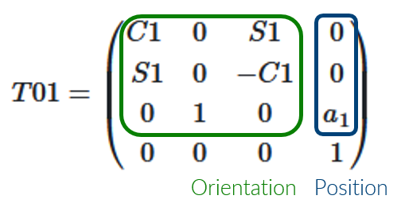

# Méthode

Nous décomposerons l'étude du bras final en plusieurs sous-parties, en partant d'un système comprenant 2 degrés de libertés et en en ajoutant un par un jusqu'à atteindre le nombre de degrés de libertés du bras réel. 
Nous espérons ainsi pouvoir identifier à chaque étape les difficultés additionnels liés à chaque ajout. 

Pour chaque modèle, nous utiliserons la convention de [Denavit-Hartenberg](https://fr.wikipedia.org/wiki/Denavit-Hartenberg) pour visualiser de façon schématique le système. 
Ensuite, nous définirons les matrices de transition pour chaque liaison, même si dans les premiers cas d'étude une approche graphique pourrait amener à une solution plus rapide. 

Enfin, nous préciserons pour chaque système une solution, relié à un script python puis une implémentation en Rust sur un système réel.

## Schéma cinématique 

*Pour simplifier au maximum le système visuellement*

Nous choisirons de respecter les conventions de **Denavit-Hartenberg** afin de schématiser nos sysèmes et de positionner des repères sur chaque liaison.

## Matrices de transition 

*Pour découper le problème et représenter mathématiquement chaque liaison*

exemple : 

Elle est composée d'une **matrice d'orientaiton** 3x3 qui représente le changement de repère effectué au niveau d'une liaison parfaite (ici, nous aurons affaire uniquement à des liaisons pivots), et d'un **vecteur de position** qui représente le changement de repère d'un point d'interêt de notre système (point commun entre deux liaisons ou point final à positionner)

## Matrice caractéristique

*pour rassembler les petits problèmes et représenter le système complet*

Cette matrice est obtenue en faisant en multipliants toutes les matrices obtenues. 

## Cinématique normale 

*Calcule la position du bras suivant les angles des liaisons*

## Cinématique inverse 

*Calcule les angles des liaisons suivant la position du bras*
