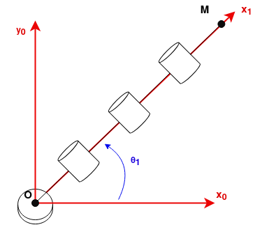
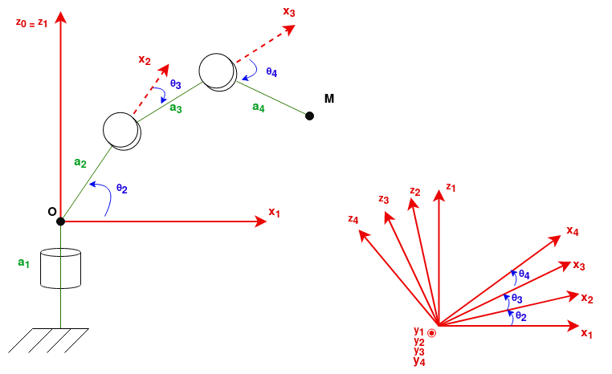

# Méthode alternative - Algorithme d'optimisation


Pour ce chapitre la méthode change aprés la cinématique :
- Schéma cinématique *pour simplifier au maximum le système visuellement*
- Matrices de transition *pour découper le problème et représenter mathématiquement chaque liaison*
- Matrice caractéristique *pour rassembler les petits problèmes et représenter le système complet*
- Cinématique normale *qui décrit la position du bras suivant les angles des liaisons*
- **Equation à minimiser** *à définir afin que notre système ait un objectif*
- **Matrice jacobienne** *à calculer pour obtenir les dérivées partielles de l'équation*
- **Levenberg-Marquart** *est l'algorithme itératif qui trouvera la solution*

Dans cette partie, nous allons nous concentrer sur une autre méthode pour la cinématique inverse, en réfléchissant différemment. Cette méthode est utilisable peut importe votre nombre de liaisons et vos restrictions. Cependant cette méthode n'est pas géométrique et nécessitera plusieurs itérations pour obtenir les angles voulus.


Le cas étudié sera le même que pour le [4 DOF](./4_dof.md), mais vous pouvez appliquer cette méthode pour les autres cas.


## Schéma cinématique
On ne va pas échapper aux premières étapes nous amenant jusqu'aux équations de cinématique. Même si nous utilisons le cas du [4 DOF](./4_dof.md) et que nous pouvons réutiliser leurs équations, nous vous proposont ici de faire un nouveau schéma qui permet de voir le système d'une autre approche.

### θ<sub>1</sub>
Avec une vue du dessus, nous pouvons voir très simplement quelle équation nous devons choisir pour **θ<sub>1</sub>** dans le cas spécifique de notre robot :   


Ainsi nous voyons que l'angle **θ<sub>1</sub>** est la seule liaison permettant de bouger sur le plan **(x,y)**. Nous pouvons directement faire de la cinématique inverse et conclure pour **θ<sub>1</sub>** :

$$
θ_1 = atan2(\cfrac{y}{x})
$$

## Matrices de transition
Nous pouvons aussi représenter la matrice de transition **T01** que nous pouvons déduire depuis le schéma ci-dessus :  
$$
T01 = 
\left(\begin{array}{cc}
C1 & -S1 & 0 & 0\\\\
S1 & C1 & 0 & 0\\\\
0 & 0 & 1 & a_1\\\\
0 & 0 & 0 & 1
\end{array}\right)
$$

Après voir fini cela, nous pouvons nous attaquer au reste du système en ignorant l'impact de **θ<sub>1</sub>**. En faisant un schéma de profil, nous pouvons voir que les trois liaisons suivantes sont identiques :    


Comme nos liaisons sont identiques, nos matrices de transitions le sont aussi :
$$
T12 = 
\left(\begin{array}{cc}
C2 & 0 & -S2 & a_2C2\\\\
0 & 1 & 0 & 0\\\\
S2 & 0 & C2 & a_2S2\\\\
0 & 0 & 0 & 1
\end{array}\right)
$$
$$
T23 = 
\left(\begin{array}{cc}
C3 & 0 & -S3 & a_3C3\\\\
0 & 1 & 0 & 0\\\\
S3 & 0 & C3 & a_3S3\\\\
0 & 0 & 0 & 1
\end{array}\right)
T34 = 
\left(\begin{array}{cc}
C4 & 0 & -S4 & a_4C4\\\\
0 & 1 & 0 & 0\\\\
S4 & 0 & C4 & a_4S4\\\\
0 & 0 & 0 & 1
\end{array}\right)
$$

## Matrice caractéristique
En mutipliant **T01\*T12\*T23\*T34 = T04** on obtient la matrice caractéritique du système :
$$
T04 =
\left(\begin{array}{cc}
? & ? & ? & C1(a_2C2 + a_3C23+a_4C234)\\\\
? & ? & ? & S1(a_2C2 + a_3C23+a_4C234)\\\\
? & ? & ? & a_1 + a_2S2 + a_3S23 + a_4S234\\\\
0 & 0 & 0 & 1
\end{array}\right)
$$

avec  $$ C234 = cos(θ_2+θ_3+θ_4), S234 = sin(θ_2+θ_3+θ_4) $$

## Cinématique normale
Nous pouvons donc écrire les équations de cinématique :   
$$ 
\begin{cases}
    x = cos(θ_1)\*(a_2\*cos(θ_2)+a_3\*cos(θ_2+θ_3+θ_4))\\\\
    y = sin(θ_1)\*(a_2\*cos(θ_2)+a_3\*cos(θ_2+θ_3+θ_4))\\\\
    z = a_1 + a_2\*sin(θ_2) + a_3\*sin(θ_2+θ_3) + a_4\*sin(θ_2+θ_3+θ_4)
\end{cases}
$$

## Equation à minimiser
Pour trouver quels angles nous devons choisir pour atteindre une certaine position **(x,y,z)** nous devons définir une équation qui, si minimale, alors confirme que les angles sont bons. Pour cela nous allons utiliser les équations de cinématique. Afin de minimiser la taille des matrices qui vont arriver, nous allons simplifier ces équations pour passer de 3 à 2 équations :  
$$ 
\begin{cases}
    \sqrt{x^{2}+y^{2}} = a_2\*cos(θ_2)+a_3\*cos(θ_2+θ_3+θ_4)\\\\
    z = a_1 + a_2\*sin(θ_2) + a_3\*sin(θ_2+θ_3) + a_4\*sin(θ_2+θ_3+θ_4)
\end{cases}    
$$
$$
\begin{cases}
    0 = a_2\*cos(θ_2)+a_3\*cos(θ_2+θ_3+θ_4)-\sqrt{x^{2}+y^{2}}\\\\
    0 = a_1 + a_2\*sin(θ_2) + a_3\*sin(θ_2+θ_3) + a_4\*sin(θ_2+θ_3+θ_4)-z
\end{cases}
$$

Ici nos équations montrent la différence entre la positions voulue **(x,y,z)** et la position calculée à partir des angles. Si cette différence est égale à zéro, alors les angles choisis permettront d'arriver à la position voulue.
On définit donc la fonction à minimiser :
$$
F(θ_2,θ_3,θ_4) = 
\begin{cases}
    a_2\*cos(θ_2)+a_3\*cos(θ_2+θ_3+θ_4)-\sqrt{x^{2}+y^{2}}\\\\
    a_1 + a_2\*sin(θ_2) + a_3\*sin(θ_2+θ_3) + a_4\*sin(θ_2+θ_3+θ_4)-z
\end{cases}
$$

## Matrice jacobienne  
Nous devons alors calculer la matrice jacobienne associée à cette fonction. C'est donc la matrice des dérivées partielles de la fonction. Dans notre cas cela sera une matrice 2\*3 car nous avons deux équations et 3 variables **(θ<sub>2</sub>,θ<sub>3</sub>,θ<sub>4</sub>)** cependant si vous avez gardé les 3 équations de la cinématique, vous aurez une matrice 3\*3.
$$
J(F(θ_2,θ_3,θ_4)) = 
\left(\begin{array}{cc}
    -a_2S2-a_3S23-a_4S234 & -a_3S23-a_4S234 & -a_4S234\\\\
    a_2C2+a_3C23+a_4C234 & a_3C23+a_4C234 & a_4C234\\\\
\end{array}\right)
$$

## Levenberg-marquart
Une fois la fonction et sa jacobienne créées, nous pouvons sortir l'algorithme d'optimisation/minimisation de notre choix. Dans cet exemple, nous avons choisi Levenberg-Marquart.

En définissant **Ɛ** l'état de notre système **(θ<sub>2</sub>,θ<sub>3</sub>,θ<sub>4</sub>)**. L'algorithme agit de cette façon :
```
Jusqu'à N_max itérations :
    Objectif = F(Ɛ)
    Résidus = 2*J(F(Ɛ))*F(Ɛ)
    Si Résidus est très petit:
        On valide Ɛ et on sort de l'algorithme
    Sinon:
        Ɛ_new = Ɛ - (J(F(Ɛ))*F(Ɛ) + λ*I_3)^{-1} * J(F(Ɛ))*F(Ɛ)
        Si ||F(Ɛ_new)|| < ||F(Ɛ)||:
            Ɛ = Ɛ_new
            On diminue λ
        Sinon:
            On augmente λ 
```

A la sortie de cet algorithme, si Résidus est bien très petit, alors les angles **Ɛ=(θ<sub>2</sub>,θ<sub>3</sub>,θ<sub>4</sub>)** sont très proche de la valeure parfaite que l'on aurait trouvé avec la méthode géométrique.

## Conclusion et amélioration
Nous avons donc à la fin de notre algorithme les angles **θ<sub>2</sub>**,**θ<sub>3</sub>** et **θ<sub>4</sub>** de plus nous avions déjà déterminé **θ<sub>1</sub>** tout au début. La cinématique inverse est donc finie.


Cette méthode permet de juste devoir calculer la cinématique directe et d'utiliser un algorithme itératif qui va résoudre la cinématique inverse pour nous. Un gros avantage de cette méthode est que peut importe le nombre d'angles à déterminer, une solution sera trouvée tant qu'assez d'itérations sont faites. Le problème de cette méthode est qu'on ne peut pas toujours se permettre de faire plein d'itérations.

Si des contraintes vous sont imposées, vous pouvez aussi insérer ces contraintes au milieu de l'algorithme Levenberg-Marquart.
Par exemple, des bornes peuvent être ajoutées afin de restreindre les variables à certaines valeurs.
Juste après avoir calculé **Ɛ_new**, vous pouvez faire une condition du type :   
``` Si Ɛ_new > Ɛ_max, Alors Ɛ_new = Ɛ_max```

